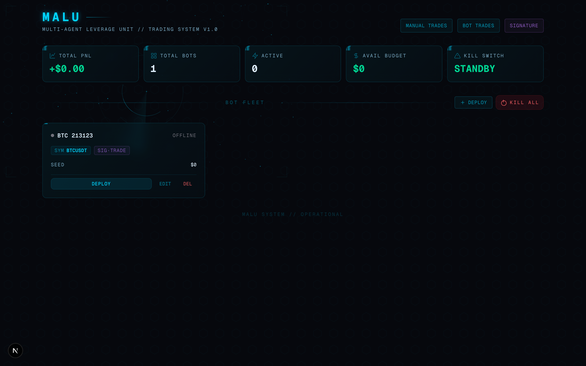
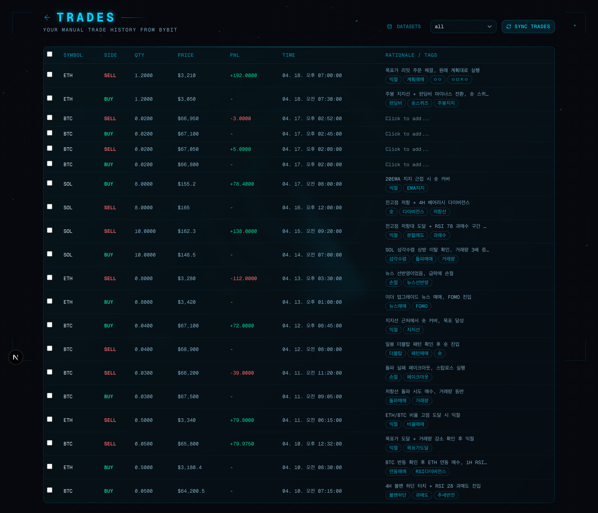
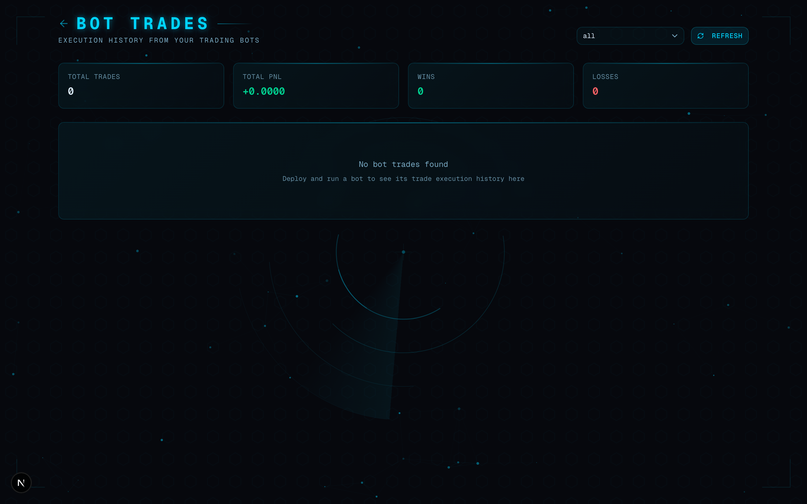
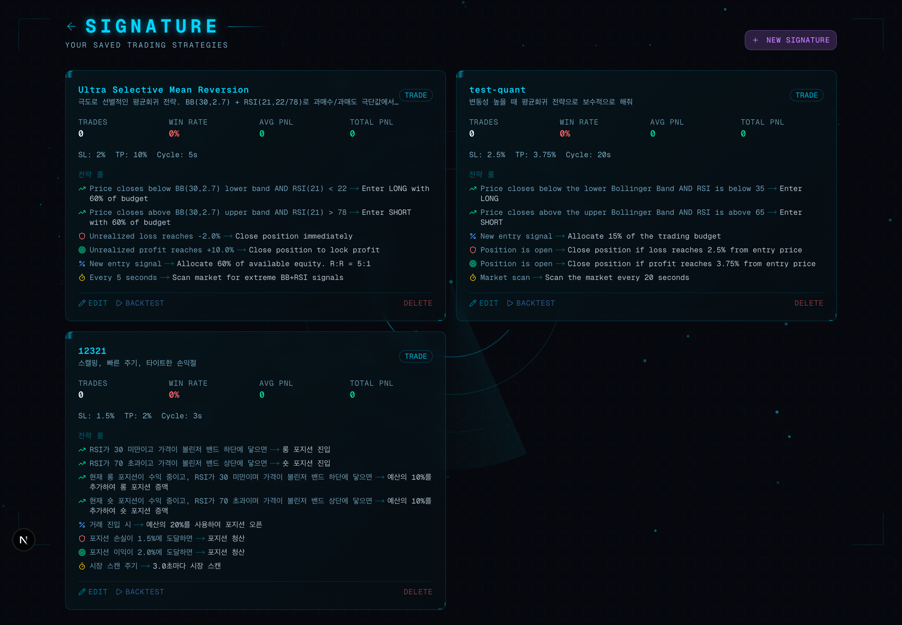
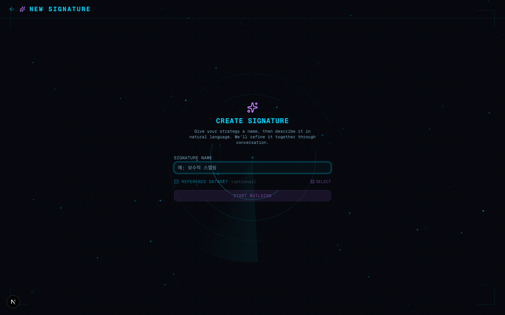
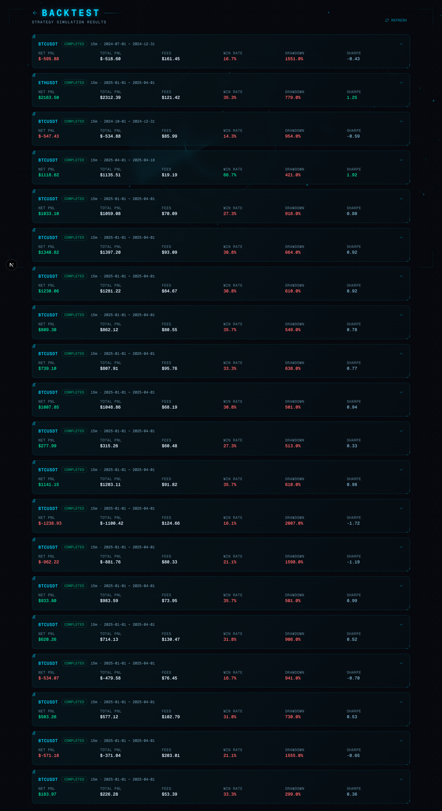
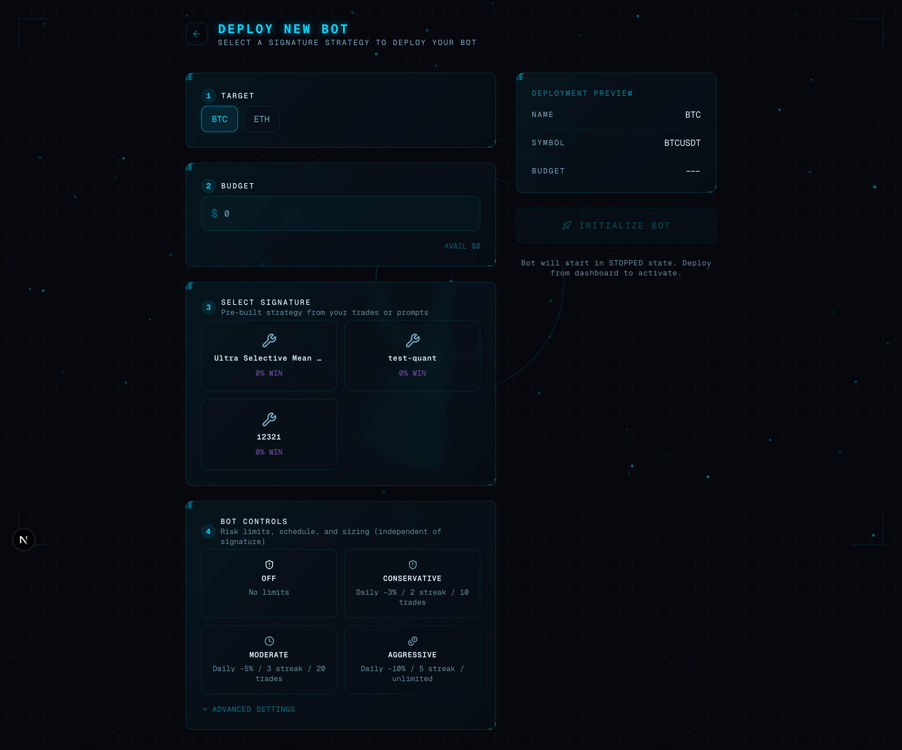
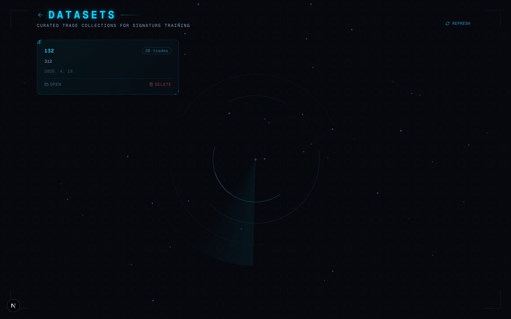

# MALU 사용 매뉴얼

**Multi-Agent Leverage Unit // Trading System v1.0**

Bybit USDT 선물(Linear Perpetual) 자동매매 시스템

---

## 목차

1. [홈 대시보드](#1-홈-대시보드)
2. [수동 트레이드 (TRADES)](#2-수동-트레이드-trades)
3. [봇 트레이드 (BOT TRADES)](#3-봇-트레이드-bot-trades)
4. [시그니처 (SIGNATURE)](#4-시그니처-signature)
5. [새 시그니처 생성](#5-새-시그니처-생성)
6. [백테스트 (BACKTEST)](#6-백테스트-backtest)
7. [봇 배포 (DEPLOY)](#7-봇-배포-deploy)
8. [데이터셋 (DATASETS)](#8-데이터셋-datasets)
9. [전체 워크플로우](#9-전체-워크플로우)

---

## 1. 홈 대시보드



시스템 전체 상태를 한눈에 파악하는 메인 화면입니다.

### 상단 HUD 지표

| 지표 | 설명 |
|------|------|
| **TOTAL PNL** | 전체 누적 손익 (초록: 수익, 빨강: 손실) |
| **TOTAL BOTS** | 생성된 봇 총 개수 |
| **ACTIVE** | 현재 실행 중인 봇 수 (시안 하이라이트) |
| **AVAIL BUDGET** | 사용 가능한 예산 잔액 |
| **KILL SWITCH** | 긴급 정지 스위치 (STANDBY / ARMED) |

### 봇 플릿 (BOT FLEET)

- 배포된 봇들이 카드 형태로 표시됩니다.
- 각 카드에는 봇 이름, 심볼, 시그니처 타입, 시드 금액, 상태(OFFLINE/RUNNING)가 표시됩니다.
- **DEPLOY** 버튼으로 봇을 실행하고, **EDIT** / **DEL** 로 수정/삭제할 수 있습니다.

### 상단 네비게이션

- **MANUAL TRADES** → 수동 트레이드 내역
- **BOT TRADES** → 봇 실행 내역
- **SIGNATURE** → 시그니처(전략) 관리

---

## 2. 수동 트레이드 (TRADES)



Bybit에서 직접 수동으로 체결한 거래 내역을 조회하고 주석을 달 수 있는 페이지입니다.

### 주요 기능

#### SYNC TRADES (거래 동기화)
- 우측 상단 **SYNC TRADES** 버튼을 클릭하면 Bybit에서 수동 거래 내역을 가져옵니다.
- 봇이 실행한 주문은 자동으로 필터링되어 사람이 직접 체결한 거래만 표시됩니다.

#### 거래 주석 달기
- 각 거래의 **RATIONALE / TAGS** 열을 클릭하면 인라인 편집 모드로 전환됩니다.
- **Rationale**: 왜 이 거래를 했는지 이유를 기록합니다.
- **Tags**: 쉼표로 구분된 태그를 추가합니다 (예: `스캘핑, 돌파, RSI반등`).
- 이 주석은 나중에 시그니처 생성 시 AI가 참고합니다.

#### 데이터셋 생성
1. 좌측 체크박스로 원하는 거래들을 선택합니다.
2. 상단에 나타나는 **CREATE DATASET** 버튼을 클릭합니다.
3. 이름과 설명을 입력하고 저장하면 데이터셋이 생성됩니다.
4. 생성된 데이터셋은 시그니처 학습용 참고 자료로 활용됩니다.

#### 심볼 필터
- 상단 드롭다운으로 특정 심볼(BTCUSDT, ETHUSDT 등)만 필터링할 수 있습니다.

---

## 3. 봇 트레이드 (BOT TRADES)



배포된 봇들이 자동으로 실행한 거래 내역을 조회하는 페이지입니다.

### 상단 요약 카드

| 항목 | 설명 |
|------|------|
| **TOTAL TRADES** | 봇이 실행한 총 거래 수 |
| **TOTAL PNL** | 총 손익 |
| **WINS** | 수익 거래 수 |
| **LOSSES** | 손실 거래 수 |

### 필터 및 조회
- 상단 드롭다운으로 특정 봇의 거래만 필터링할 수 있습니다.
- **REFRESH** 버튼으로 최신 데이터를 갱신합니다.
- SIDE(LONG/SHORT), STATUS, PNL은 색상으로 구분됩니다.

---

## 4. 시그니처 (SIGNATURE)



저장된 매매 전략(시그니처)을 관리하는 페이지입니다. 시그니처는 봇에 적용할 전략 규칙 세트입니다.

### 시그니처 카드 구성

각 시그니처 카드에는 다음 정보가 표시됩니다:

- **이름 및 설명**: 전략의 이름과 간단한 설명
- **타입 뱃지**: `NL` (자연어로 생성) 또는 `TRADE` (거래 데이터 기반)
- **통계**: TRADES(분석 거래 수), WIN RATE(승률), AVG PNL, TOTAL PNL
- **설정 요약**: SL(손절 %), TP(익절 %), Cycle(스캔 주기)
- **전략 룰**: 구체적인 진입/청산 조건이 한글로 표시됩니다

### 룰 아이콘 의미

| 아이콘 | 타입 | 설명 |
|--------|------|------|
| ▲ (초록) | entry | 진입 조건 |
| ▼ (빨강) | stop_loss | 손절 조건 |
| ★ (주황) | take_profit | 익절 조건 |
| ■ (파랑) | position_size | 포지션 사이즈 |
| ● (보라) | cycle_interval | 스캔 주기 |

### 액션 버튼

- **EDIT** → 대화형으로 전략을 수정합니다
- **BACKTEST** → 과거 데이터로 전략을 시뮬레이션합니다
- **DELETE** → 시그니처를 삭제합니다
- **NEW SIGNATURE** (우측 상단) → 새 시그니처를 생성합니다

### 백테스트 실행

BACKTEST 버튼을 클릭하면 인라인 폼이 나타납니다:
1. **Symbol**: 테스트할 심볼 (기본: BTCUSDT)
2. **Capital**: 시뮬레이션 자본금 (기본: $10,000)
3. **Start / End Date**: 테스트 기간 설정
4. **RUN** 클릭 → 백테스트 실행 후 결과는 BACKTEST 페이지에서 확인

---

## 5. 새 시그니처 생성



AI 대화를 통해 새로운 매매 전략을 만드는 페이지입니다.

### 생성 과정

#### Step 1: 이름 설정
- **SIGNATURE NAME** 입력란에 전략 이름을 입력합니다 (예: `보수적 스캘핑`).
- **REFERENCE DATASET** (선택사항): 기존 데이터셋을 참고 자료로 연결할 수 있습니다.
- **START BUILDING** 클릭으로 대화를 시작합니다.

#### Step 2: AI 대화로 전략 구축
대화창에서 자연어로 전략을 설명하면 AI가 구체적인 파라미터와 룰을 생성합니다.

**추천 프롬프트 예시:**
- `보수적으로 소액 단타` → 보수적 스캘핑 전략
- `공격적 진입, 손절 2% 익절 6%` → 공격적 전략, 정확한 수치 반영
- `스윙, 안전하게 작은 포지션` → 안정적인 스윙 전략
- `스캘핑, 빠른 주기, 타이트한 손익절` → 빠른 스캘핑

#### Step 3: 실시간 미리보기
우측 패널에서 AI가 생성한 전략 설정을 실시간으로 확인할 수 있습니다:
- **JUDGMENT**: BB Period, BB Std, RSI Period, RSI OS/OB
- **ACTION & DEFENSE**: Position Size %, SL %, TP %
- **CYCLE INTERVAL**: 마켓 스캔 주기 (초)
- **전략 룰**: 진입/청산 조건 목록

#### Step 4: 반복 수정
대화를 이어가며 전략을 세밀하게 조정할 수 있습니다:
- `손절 좀 더 타이트하게` → 손절 비율 조정
- `포지션 크기 줄여줘` → 리스크 관리 조정
- `RSI 기준 좀 더 보수적으로` → 지표 파라미터 변경

### 시그니처 편집

기존 시그니처의 **EDIT** 버튼을 클릭하면 동일한 대화 인터페이스에서 전략을 계속 수정할 수 있습니다. 이전 대화 기록이 유지되어 맥락을 이어갈 수 있습니다.

---

## 6. 백테스트 (BACKTEST)



시그니처 전략의 과거 데이터 시뮬레이션 결과를 확인하는 페이지입니다.

### 결과 카드 구성

각 백테스트 실행 결과가 접이식 카드로 표시됩니다:

**요약 행:**
- 심볼, 상태(RUNNING/COMPLETED/ERROR), 테스트 기간

**통계 그리드 (클릭하여 펼치기):**

| 지표 | 설명 | 양호 기준 |
|------|------|-----------|
| **NET PNL** | 순 손익 (수수료 차감) | 양수 |
| **TOTAL PNL** | 총 손익 | 양수 |
| **FEES** | 총 수수료 | - |
| **WIN RATE** | 승률 | > 50% (초록) |
| **DRAWDOWN** | 최대 낙폭 | 낮을수록 좋음 |
| **SHARPE RATIO** | 샤프 비율 | > 1.0 (초록) |

**상세 내역 (펼친 상태):**
- **EQUITY CURVE**: 자산 변동 차트
- **TRADES 테이블**: 각 거래의 SIDE, ENTRY, EXIT, QTY, PNL, FEE, EXIT REASON
- **DELETE RUN** 버튼으로 결과 삭제

### 자동 업데이트
- 실행 중인 백테스트는 2초 간격으로 자동 갱신됩니다.
- 완료 시 자동으로 결과가 표시됩니다.

---

## 7. 봇 배포 (DEPLOY)



시그니처 전략을 실제 봇으로 배포하는 페이지입니다.

### 배포 단계

#### Step 1: TARGET (대상 심볼)
- **BTC** 또는 **ETH** 퀵 버튼으로 심볼을 선택합니다.

#### Step 2: BUDGET (예산)
- 봇에 할당할 초기 자본금을 입력합니다.
- 하단에 사용 가능한 잔액(AVAIL)이 표시됩니다.

#### Step 3: SELECT SIGNATURE (전략 선택)
- 생성된 시그니처 카드 중 하나를 클릭하여 선택합니다.
- 선택된 카드는 보라색으로 하이라이트됩니다.
- 시그니처가 없으면 SIGNATURE 페이지로 이동하라는 안내가 표시됩니다.

#### Step 4: BOT CONTROLS (봇 제어)
리스크 관리 프리셋을 선택하거나 직접 설정합니다:

| 프리셋 | 일일 손실 한도 | 연속 손실 | 일일 거래 수 |
|--------|---------------|-----------|-------------|
| **OFF** | 제한 없음 | 제한 없음 | 제한 없음 |
| **CONSERVATIVE** | -3% | 3회 | 10건 |
| **MODERATE** | -5% | 5회 | 30건 |
| **AGGRESSIVE** | -10% | 10회 | 무제한 |

**ADVANCED SETTINGS** 토글로 세부 설정 가능:
- **RISK**: Max Daily Loss %, Max Consecutive Losses
- **SCHEDULE**: Cooldown (초), Max Trades/Day
- **SIZING**: STRATEGY % vs FIXED $ 모드, Compound 복리 옵션

#### 우측 배포 미리보기
- 설정된 내용이 실시간으로 미리보기에 반영됩니다.
- **INITIALIZE BOT** 버튼으로 봇을 생성합니다.
- 봇은 **STOPPED 상태**로 시작되며, 홈 대시보드에서 **DEPLOY** 버튼으로 실행합니다.

---

## 8. 데이터셋 (DATASETS)



시그니처 학습용 거래 데이터 컬렉션을 관리하는 페이지입니다.

### 데이터셋 카드

각 카드에 표시되는 정보:
- **이름** (시안)
- **거래 수** 뱃지 (예: `28 trades`)
- **AUTO-SYNC** 뱃지 (자동 동기화 활성화 시)
- 설명 및 생성일
- **OPEN** / **DELETE** 버튼

### 데이터셋 상세 페이지

**OPEN** 클릭 시 상세 페이지로 이동합니다:
- 포함된 거래 목록 조회 (Symbol, Side, Qty, Price, PNL, Time, Tags)
- **EDIT** 모드에서 이름/설명/자동동기화 설정 변경
- **SYNC** 버튼으로 Bybit에서 신규 거래 가져오기
- **CSV** 업로드로 외부 데이터 추가
- 개별 거래 삭제 가능

### 데이터셋 만드는 방법

1. **TRADES 페이지에서**: 거래 선택 → CREATE DATASET
2. **데이터셋 상세에서**: CSV 업로드 또는 SYNC로 추가

---

## 9. 전체 워크플로우

MALU의 기본 사용 흐름은 다음과 같습니다:

```
① 거래 기록 수집
   TRADES → SYNC TRADES → 주석 달기(Rationale/Tags)
                ↓
② 데이터셋 생성 (선택사항)
   거래 선택 → CREATE DATASET
                ↓
③ 시그니처 생성
   SIGNATURE → NEW SIGNATURE → AI 대화로 전략 구축
   (또는 데이터셋 기반으로 자동 생성)
                ↓
④ 백테스트 검증
   시그니처 카드 → BACKTEST → 결과 확인
   (불만족 시 EDIT으로 전략 수정 후 재테스트)
                ↓
⑤ 봇 배포
   DEPLOY → 심볼/예산/시그니처/리스크 설정 → INITIALIZE BOT
                ↓
⑥ 모니터링
   홈 대시보드에서 봇 상태 확인
   BOT TRADES에서 실행 내역 확인
   KILL SWITCH로 긴급 정지
```

### 핵심 팁

- **시그니처 생성 시**: 한글로 자연스럽게 설명하면 AI가 파라미터를 자동 설정합니다.
- **백테스트 결과**: 라이브 성과는 백테스트 대비 30~50% 낮을 수 있습니다.
- **리스크 관리**: 처음에는 CONSERVATIVE 프리셋으로 시작하는 것을 권장합니다.
- **KILL SWITCH**: 전체 봇을 즉시 정지시키는 긴급 버튼입니다. 시장 급변 시 활용하세요.

---

*MALU System // v1.0 // Multi-Agent Leverage Unit*
